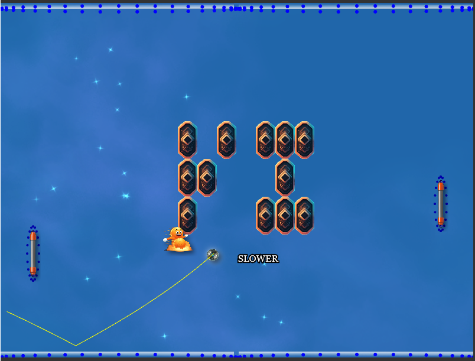

## Spin Pong

It's Pong with a few twists. Let's call it "Spin Pong". There are surfaces that move
around the paddles and walls. These moving surfaces can be used to give the ball a spin
or undo existing spin. Pretty much like how you give a ball a spin in any ball-game; like
ping-pong, tennis or soccer.




```
/*
Notes:
- this is merely a very early prototype to see if it would even be fun.
- it's fiendlishy hard in its current state. It needs to be simplified.
*/

/*
TODO power-ups/downs:
[x] slow ball
[x] fast ball
[x] reset ball spin and velocity (add some art in the middle of the field, and when ball hits, trigger effect)
[x] larger bat
[x] smaller opponent bat
- multiple balls
- freeze opponent wall
- freeze ball for N seconds (to adjust spin)
- magnets (attracts ball and/or paddles depending on placement)
- upgrade paddle (to ... things -- get different art)
- ball shrinks every collision (winner is last paddle to touch it before it disintegrates)
  supposedly something like 3.3% / second

FIXES:
- perhaps only draw prediction until 'dead' or 'next paddle hit' (and not several paddle hits)
[x] spin-decay: spin of the ball should decrease over time (or at least per bounce?)

IDEAS:
- maybe a brickwall between the bats appear that then one player will have to knock a hole in to get ball over 
  to other side (like a temporary block-breaker (Arkanoid))

TODO thoughts:
- To get more variety, we'll probably need to make bats and walls ovals
- perhaps reset surface speeds after each collision? will it make it harder or easier?
- round spin/speeds to integer between 0-10? show that number somewhere (next to wall/bats?) so you can easily counter?
- maybe hold key for spin, and releasing key resets it back to 0 spin
- what other pong-like games are there that can be temporary features (triggered by power-ups?)
- *** maybe have a second (or primary?) game-mode where you only control spin (not paddle movement)
- keep track of number of paddle-bounces (as a type of minir-score)
- another bot-type which will use spin
- another bot-type which will use and take current spin into consideration
- another bot-type which will home in on power-ups (without discrimination of what they do)
- another bot-type which will go for power-ups and discriminate what they do (i.e. work to avoid bad ones)
- give bots names (from famous games, like GLaDOS)
- if a paddle hits ball X (10?) times in a row, paddle will become slower and slower until it can no longer move
  ...perhaps add some mechanic here (power depletes and recharges (how?))
- add FCT to show when spin changes on walls/paddles
- positive power-ups (for one-self) can perhaps be 'collected' and used later?
- sub-game: uncover a background and guess what the it contains (uncover by sending ball there)
- pinata-type-thing -- large thing that needs to be knocked down to with N hits, then explodes into a bunch of powerups,
  number of knocks should count _down_ using some floating text (so... e.g. 10->9-> ...)
- get point for each brick you remove? (you = last paddle to touch ball)
- use generated generative cartoon characters for power-ups (i.e. a guy running for faster ball, etc)
- on "death": lightning from where ball slipped through to the bat -- and bat blows up
- TODO: Need support for TTL and undoEffect in powerUp config. Also:
  "drop-chance"
- This should work with LG TV remotes, e.g. vertical/horizontal movement to control spin of paddle/wall respectively
- Temporary (offensive) paddles that can do N hits before disintegrating -- goes together with player's other paddle

BUG:
- a really fast ball will go 'through' the paddle (need same fix as elsewhere)

Achievement tracking:
- highest velocity ball returned
- highest velocity ball won
- number of paddle exchanges survived (left->right->leftt)
- own goal (paddle -> lost)
*/
```
